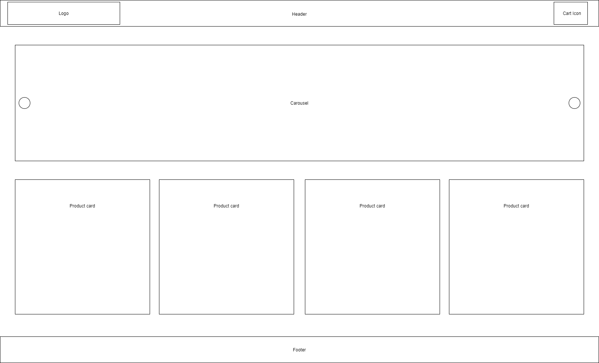

# logoipsum

Description: Develop an ecommerce homepage

[Click here to check it out](https://ericanoronha.github.io/teste-logoipsum/) :)

## Should have

Header - Must include a separate logo and cart icon.
Body - Must include 1 functional carousel and 4 product cards
Footer - It should include centralized links to "FAQ", "Help", "About" pages, they don't need to be functional.

## Elements:

Cart Icon - No need to be functional
Carousel - Must have at least three images and need to be functional
Cards - Each card must have an image and display "Add to cart" and "Add to wish list" buttons

Note: It is not necessary to use the images displayed in this folder.

Rating Criteria:

- Usability
- Creativity
- Code Organization
- Code Performance
- Code Documentation
- Best pratices

Note: Try to use the vanilla js (Pure Javascript, without jquery, dojo, mootools, or other kind of framework) and vanilla css (Pure CSS, without bootstrap, foundation, bulma, or other kind of style framework)

## Wireframe

